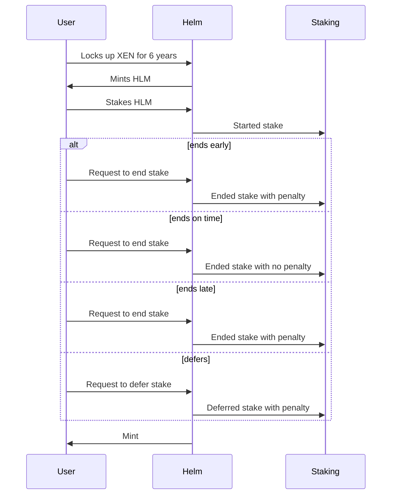
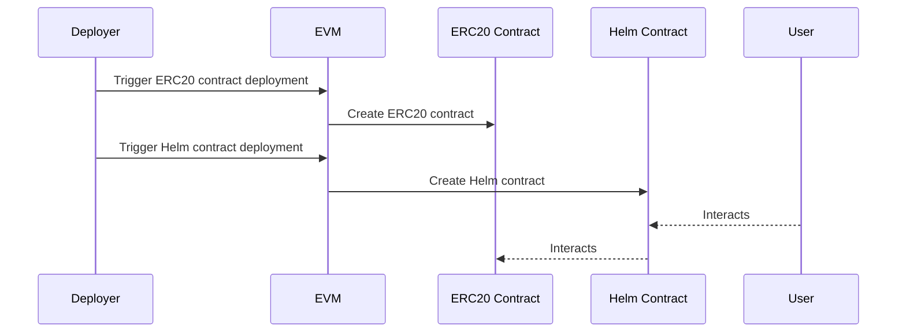

# Architecture

#### End to end flow

```mermaid
sequenceDiagram
    User->>Helm: Locks up XEN for 6 years
    Helm->>User: Mints HLM
    User->>Helm: Stakes HLM
    Helm->>Staking: Started stake
    alt ends early
        User->>Helm: Request to end stake
        Helm->>Staking: Ended stake with penalty
    else ends on time
        User->>Helm: Request to end stake
        Helm->>Staking: Ended stake with no penalty
    else ends late
        User->>Helm: Request to end stake
        Helm->>Staking: Ended stake with penalty
    else defers
        User->>Helm: Request to defer stake
        Helm->>Staking: Deferred stake with penalty
    end
    Helm->>User: Mint
```

#### Contract flow

```mermaid
sequenceDiagram
    Deployer->>EVM: Trigger ERC20 contract deployment
    EVM->>ERC20 Contract: Create ERC20 contract
    Deployer->>EVM: Trigger Helm contract deployment
    EVM->>Helm Contract: Create Helm contract
    User-->>Helm Contract: Interacts
    Helm Contract-->>ERC20 Contract: Interacts
```
