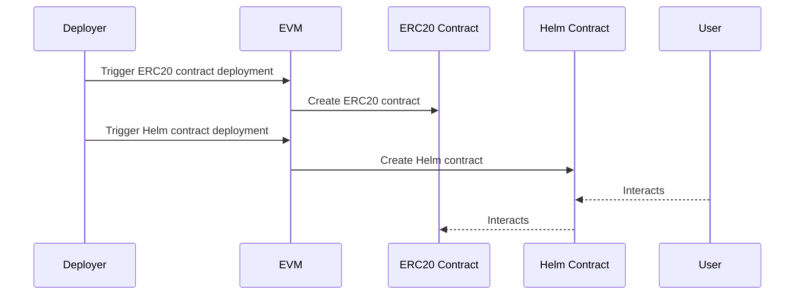

# Design

### Architecture

**Software**

code - EVM code

virtual machine - Ethereum Virtual Machine (EVM)

runtime system (process) - Ethereum node (Geth, Parity, etc.)

**Hardware**

physical processor (x68, ARM, etc.)

### User flow

### Contract flow

