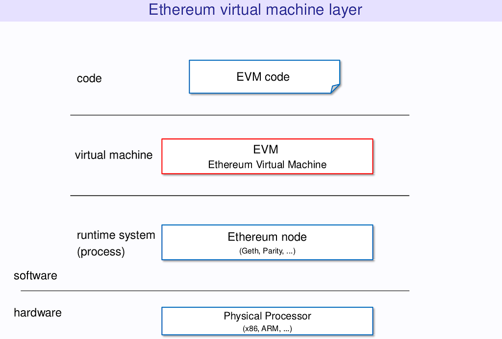
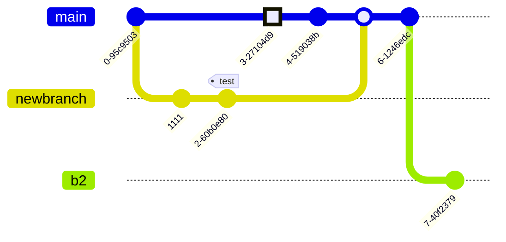
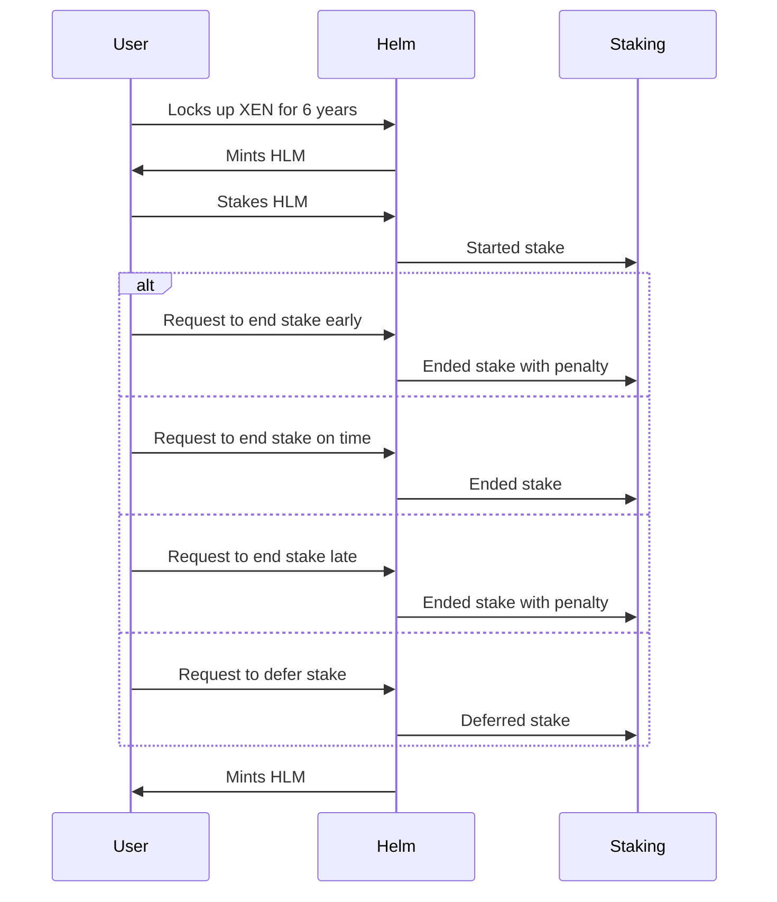
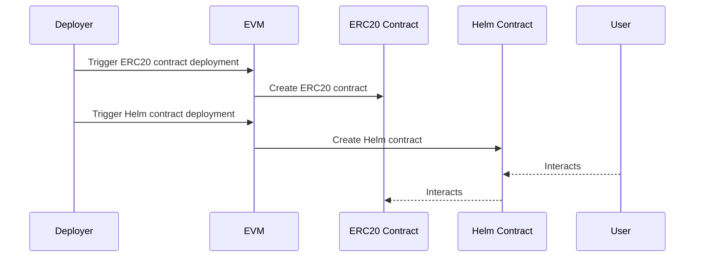

# Design

#### Architecture

#### Source code control

```mermaid
gitGraph:
    commit "Ashish"
    branch newbranch
    checkout newbranch
    commit id:"1111"
    commit tag:"test"
    checkout main
    commit type: HIGHLIGHT
    commit
    merge newbranch
    commit
    branch b2
    commit
```

#### End to end flow

```mermaid
sequenceDiagram
    User->>Helm: Locks up XEN for 6 years
    Helm->>User: Mints HLM
    User->>Helm: Stakes HLM
    Helm->>Staking: Started stake
    alt
        User->>Helm: Request to end stake early
        Helm->>Staking: Ended stake with penalty
    else
        User->>Helm: Request to end stake on time
        Helm->>Staking: Ended stake
    else
        User->>Helm: Request to end stake late
        Helm->>Staking: Ended stake with penalty
    else
        User->>Helm: Request to defer stake
        Helm->>Staking: Deferred stake
    end
    Helm->>User: Mints HLM
```

#### Contract flow

```mermaid
sequenceDiagram
    Deployer->>EVM: Trigger ERC20 contract deployment
    EVM->>ERC20 Contract: Create ERC20 contract
    Deployer->>EVM: Trigger Helm contract deployment
    EVM->>Helm Contract: Create Helm contract
    User-->>Helm Contract: Interacts
    Helm Contract-->>ERC20 Contract: Interacts
```
